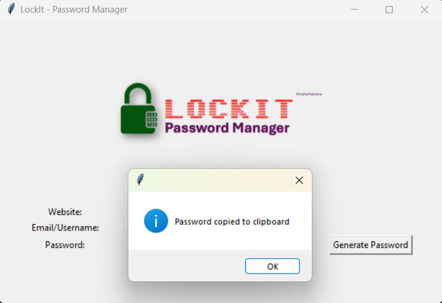

# LockIt - Password Manager

## Project Overview
**LockIt** is a simple, secure password manager built using **Tkinter**. It allows users to generate and store strong passwords for various websites, making it easy to manage login credentials. The program also copies the generated password to the clipboard for convenient pasting during signup or login.

## Screenshots




## Features
- **Generate Secure Passwords**: Automatically generate passwords with a mix of letters, symbols, and numbers.
- **Clipboard Functionality**: Copy the generated password directly to the clipboard for quick access.
- **Save Credentials**: Store website login details (email, username, and password) securely in an Excel file (`data.xlsx`).
- **User-Friendly Interface**: A graphical user interface (GUI) to input website credentials and manage passwords easily.


## Libraries Used
- **Tkinter**: For building the graphical user interface.
- **Pandas**: For handling and saving data in an Excel file.
- **Pyperclip**: To copy generated passwords to the clipboard.
- **Random**: For generating secure passwords.

## Installation

1. **Clone the Repository**:
   ```bash
   git clone https://github.com/tusharharyana/LockIt-Password_Manager.git
2. **Ensure you have Python installed. Install the required libraries using pip:**

    ```bash
    pip install pandas pyperclip openpyxl
    ```
2. **Navigate to the directory**:

    ```bash
    cd LockIt-Password_Manager
    ```
3. **Run the application**:
    ```bash
    python main.py
    ```

## Contributing

Feel free to open issues or submit pull requests if you have suggestions for improvements or enhancements.


## Contact

For any questions or feedback, please reach out to [haryanatushar@gmail.com](mailto:haryanatushar@gmail.com). 